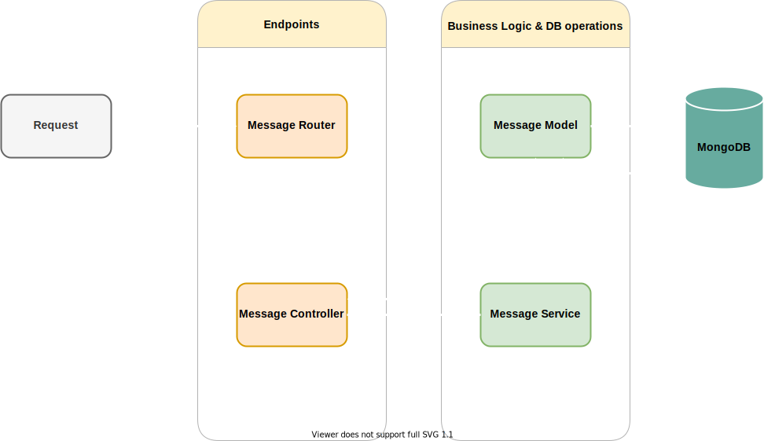

## Message API

[](https://github.com/bhambraj/jb-messages/actions/workflows/node.js.yml)

CRUD API that manages message and provides details about those messages, specifically if the messageis a palindrome or not.

Following operations are supported:

- Create / Read / Update / Delete : Message
- List all Messages

### API Docs

---

API docs get generated by swagger. Will be accessible at `{$serverAddress}/docs`. For instance if you are running this service locally at port 3000, docs will be available at `localhost:3000/docs`.

Docs for deployed service can be accessed [Here](https://jb-messages.herokuapp.com/docs)

- GET /messages
- GET /messages/:id
- PATCH /messages/:id
- POST /messages
- DELETE /messages/:id

### Architecture

---

All requests will go via the router to their respective controllers. Controllers have their own logic and all the DB operations are executed in entity service.



### Local Setup

---

#### Environment variables

```bash
    PORT=<application port> (default:3000)
    LOG_LEVEL=<application log level> (default: info)
    SERVER_URL=<server url> (default: localhost:PORT)

    #db
    DB_USER:<db user>
    DB_PASSWORD:<db password>
    DB_HOST: <db host>
    DB_NAME: <db name>
```

Once we have credentials to a DB, enter the following list of commands in order to run the application:

```
- npm i
- npm run start
```

### Testing

---

Included API tests (mocha & supertest)

##### Run Tests locally

```shell
npm run test
```

### CI/CD

---

Setup CI/CD with Gitub Actions and Heroku

On completion of CI tests, master branch from github gets deployed to Heroku
